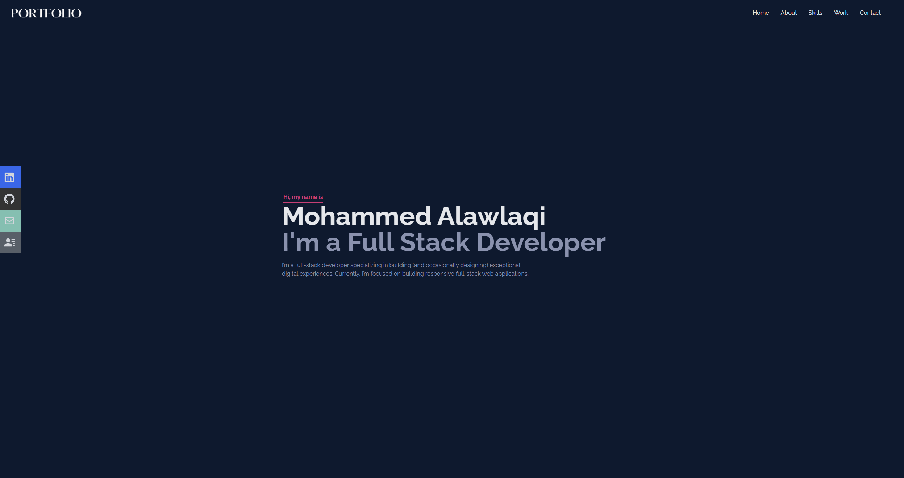
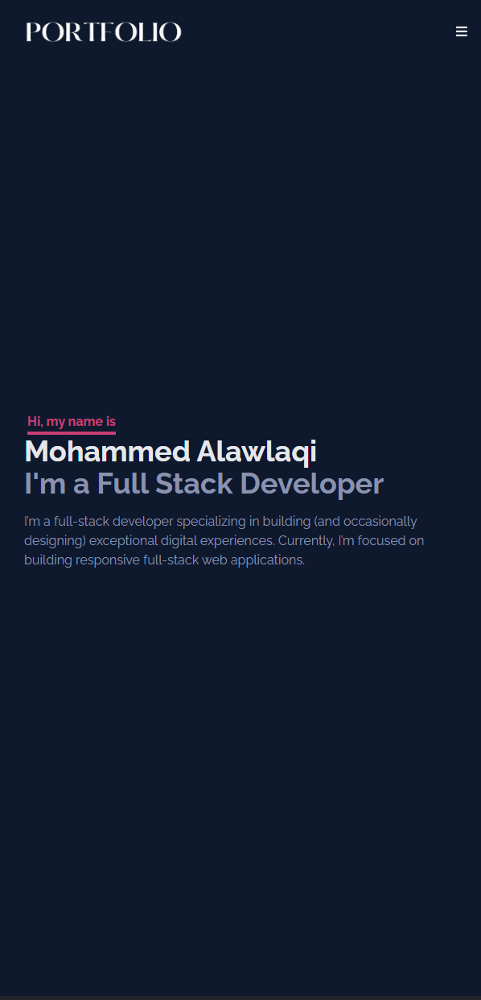
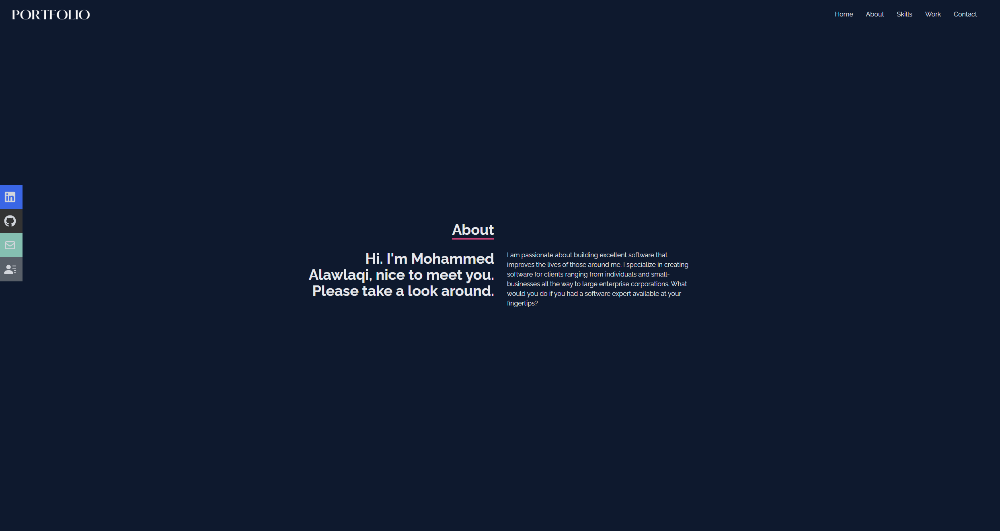

# 🚀 Mohammed Alawlaqi - Full Stack Developer Portfolio

[](https://reactjs.org/)
[](https://tailwindcss.com/)
[](https://reactrouter.com/)
[](https://opensource.org/licenses/MIT)

> A modern, responsive portfolio website showcasing my journey as a Full Stack Developer, featuring interactive project galleries, smooth animations, and a clean design.

## 🌟 Live Demo

🔗 **[View Live Portfolio](https://mohammed-alawlaqi.com/)**

## 📸 Screenshots





## ✨ Features

### 🎨 **Design & UX**
- **Responsive Design** - Optimized for all devices and screen sizes
- **Dark Theme** - Professional dark mode interface
- **Smooth Animations** - Engaging hover effects and transitions
- **Interactive Elements** - Dynamic project carousels and navigation

### 🛠️ **Technical Features**
- **React 18** - Modern React with hooks and functional components
- **React Router** - Client-side routing with lazy loading
- **Tailwind CSS** - Utility-first CSS framework
- **Error Boundaries** - Graceful error handling and recovery
- **Performance Optimized** - Code splitting and lazy loading
- **SEO Optimized** - Meta tags, Open Graph, and Twitter Cards
- **Accessibility** - WCAG compliant with ARIA labels and keyboard navigation

### 📱 **Sections**
- **Home** - Hero section with introduction
- **About** - Professional background and skills
- **Skills** - Technology stack with interactive icons
- **Projects** - Showcase of featured work with detailed views
- **Contact** - Contact form with email integration
- **Media** - Social media and professional links

## 🛠️ Technology Stack

### **Frontend**
- **React** 18.2.0 - UI library
- **React Router DOM** 6.12.1 - Client-side routing
- **Tailwind CSS** 3.3.2 - Styling framework
- **React Icons** 4.9.0 - Icon library

### **Additional Libraries**
- **React Scroll** - Smooth scrolling navigation
- **React Switch** - Toggle components
- **React Responsive** - Responsive design utilities
- **FontAwesome** - Additional icons

### **Development Tools**
- **Create React App** - Project bootstrapping
- **ESLint** - Code linting
- **Git** - Version control

## 🚀 Quick Start

### Prerequisites
- **Node.js** (v14 or higher)
- **npm** or **yarn**

### Installation

1. **Clone the repository**
   ```bash
   git clone https://github.com/Mohammed-M97/Portfolio.git
   cd Portfolio
   ```

2. **Install dependencies**
   ```bash
   npm install
   # or
   yarn install
   ```

3. **Start the development server**
   ```bash
   npm start
   # or
   yarn start
   ```

4. **Open your browser**
   Navigate to [http://localhost:3000](http://localhost:3000)

### Build for Production

```bash
npm run build
# or
yarn build
```

## 📁 Project Structure

```
src/
├── components/          # Reusable UI components
│   ├── About.jsx       # About section
│   ├── Contact.jsx     # Contact form
│   ├── ErrorBoundary.jsx # Error handling
│   ├── Home.jsx        # Hero section
│   ├── Media.jsx       # Social media links
│   ├── Navbar.jsx      # Navigation component
│   ├── Skills.jsx      # Skills showcase
│   └── Work.jsx        # Projects overview
├── projects/           # Individual project pages
│   ├── Chatapp.jsx     # Chat application project
│   ├── ServicesApp.jsx # Services platform project
│   ├── Spark.jsx       # Social media project
│   └── Toyzer.jsx      # E-commerce project
├── assets/             # Static assets
│   ├── projects/       # Project images
│   └── *.png          # Technology icons
├── data/
│   └── data.js         # Project data configuration
├── App.js              # Main app component
├── index.js            # Application entry point
└── index.css           # Global styles
```

## 🎯 Featured Projects

### 🌟 **Spark Social Media**
- **Tech Stack**: HTML5, Bootstrap, JavaScript
- **Features**: Photo sharing, user interactions, trending content
- **Live Demo**: [Spark App](https://spark-soical-media.netlify.app/)

### 🎓 **Services Learning Platform**
- **Tech Stack**: HTML5, Bootstrap, JavaScript, PHP, MySQL
- **Features**: Course management, user dashboard, admin panel
- **GitHub**: [Services App](https://github.com/Mohammed-M97/Services-App)

### 💬 **Real-time Chat Application**
- **Tech Stack**: HTML5, Bootstrap, JavaScript, PHP, MySQL
- **Features**: Real-time messaging, user authentication
- **GitHub**: [Chat App](https://github.com/Mohammed-M97/Realtime-Chat-App-client)

### 🛒 **Toyzer E-commerce Platform**
- **Tech Stack**: HTML5, Bootstrap, JavaScript
- **Features**: Product catalog, shopping cart, secure payments

## 🎨 Customization

### **Colors & Theme**
The color scheme is defined in `src/index.css`:
```css
.dark {
    --background: #0a192f;
    --textmaincolor: #e5e7eb;
    --textcolor: #8892b0;
    --buttonbg: #db2777;
    --border-color: #fff;
}
```

### **Adding New Projects**
1. Add project data to `src/data/data.js`
2. Create project component in `src/projects/`
3. Add route in `src/App.js`

## 📧 Contact

**Mohammed Alawlaqi**
- 📧 Email: [Mohammed-Alawlaqi@outlook.com](mailto:Mohammed-Alawlaqi@outlook.com)
- 💼 LinkedIn: [mohammed-alawlaqi](https://www.linkedin.com/in/mohammed-alawlaqi/)
- 🐱 GitHub: [Mohammed-M97](https://github.com/Mohammed-M97)
- 📄 Resume: [View Resume](https://drive.google.com/file/d/1LvQFA5MtJ7T8hCzufo1z5tF0XHFH3qq6/view?usp=sharing)

## 📄 License

This project is licensed under the MIT License - see the [LICENSE](LICENSE) file for details.

## 🙏 Acknowledgments

- **React Team** - For the amazing React library
- **Tailwind CSS** - For the utility-first CSS framework
- **React Icons** - For the comprehensive icon library
- **Netlify** - For easy deployment and hosting

---

⭐ **Star this repo if you found it helpful!**

Made with ❤️ by [Mohammed Alawlaqi](https://github.com/Mohammed-M97)
